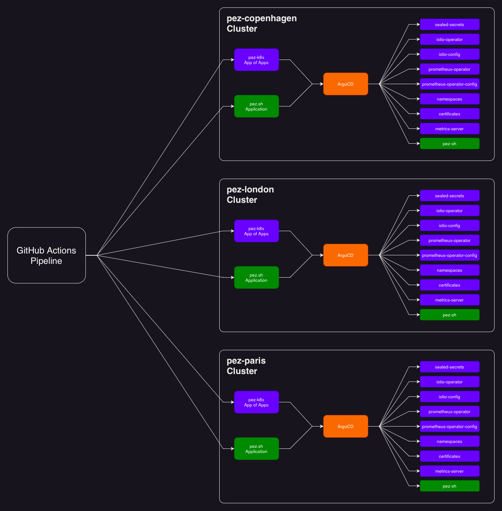

# Pez K8S

## Repo structure

### J.B.O.Y

Just a Bunch Of YAML

YAML files are seperated into different directories to give the illusion of a well-structured repo.

## What is this project?!

This is my personal K8s stack. Used to host my personal website [pez.sh](https://pez.sh).

Each cluster in this project is a mirror of each other (except hardware specific things such as node spec. & node count)

All components & services are architecture agnostic and will work on `AMD64`, `ARM64` & `ARMv7`.

Locations:

|Location|Aproximate total resources|Provider|
|---|---|---|
|London|76 CPUs, 104Gi RAM|Self-managed|
|Paris|16 CPUs, 96Gi RAM|Self-managed|
|Copenhagen|16 CPUs, 32Gi RAM|Self-managed|

Load balancing is handled via Cloudflare, each "region" is set up as an origin. Cloudflare will automatically route the client to the origin with the lowest latency.

## Components

### System Components

|Component|Status|Description|
|---|---|---|
|Istio|Implemented|Personal service-mesh of choice, directs traffic and provides mutual TLS and workload to workload auth|
|Prometheus-operator|Implemented|Collecting metrics from all services and other system-components|
|Metrics Server|Implemented|Collecting metrics of the clusters|
|Grafana|Implemented|Provides pretty dashboards (part of prometheus-operator)|
|Sealed Secrets|Implemented|Provides CRD to take in encrypted secrets, so I can upload secrets to GitHub|
|ArgoCD|Implemented|GitOps management and UI|
|Rancher Upgrade Controller|Implemented|Automates node upgrades|

#### Planned

* Datadog-agent (When I find budget)

### Workloads

|Workload|Status|Description|
|---|---|---|
|Pez.sh|Added|Personal website|
|Plex|Planned|Movie & TV-Show streaming|
|Radarr|Planned|Movie torrent management|
|Sonarr|Planned|TV Show torrent management|
|Home Assistant|Planned|Automation of smart home appliances|

# Architecure Diagram

